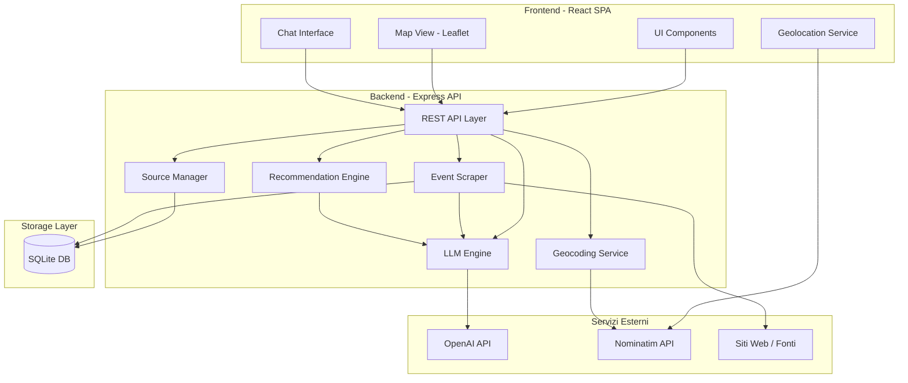
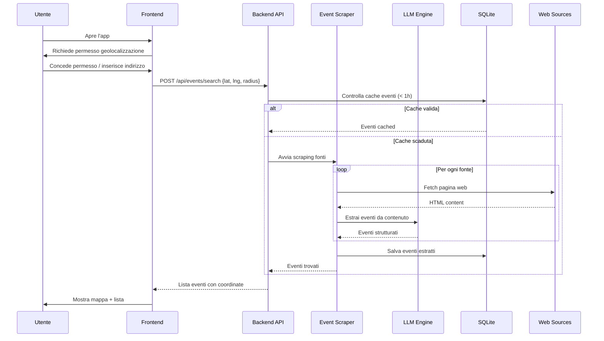

# Design Document — Local Events Finder

## Overview

Local Events Finder è una single-page application (SPA) che permette all'utente di scoprire eventi nella propria zona. L'architettura è composta da un frontend React con mappa interattiva, un backend Node.js/Express che orchestra lo scraping e le chiamate LLM, e un database leggero per la cache degli eventi e delle fonti.

**Flusso principale:**
1. L'utente apre l'app → il browser richiede la geolocalizzazione
2. La posizione viene determinata (o inserita manualmente)
3. Il backend esegue lo scraping delle fonti configurate entro il raggio
4. L'LLM estrae informazioni strutturate dal contenuto web
5. Gli eventi vengono mostrati su mappa e lista
6. L'utente può chiedere raccomandazioni o chattare con l'assistente

**Scelte tecnologiche principali:**
- **Frontend:** React 18 + TypeScript, Leaflet (mappa), TailwindCSS
- **Backend:** Node.js + Express + TypeScript
- **Database:** SQLite (via better-sqlite3) per semplicità di deploy
- **LLM:** OpenAI API (GPT-4o-mini) per estrazione eventi e raccomandazioni
- **Scraping:** Cheerio + fetch per pagine statiche, Puppeteer per pagine dinamiche
- **Geocoding:** Nominatim (OpenStreetMap) per geocodifica indirizzi

## Architecture



### Diagramma di sequenza — Ricerca eventi



## Components and Interfaces

### Frontend Components

| Componente | Responsabilità |
|---|---|
| `App` | Root component, gestione stato globale (posizione, raggio, eventi) |
| `GeolocationProvider` | Context provider per posizione utente, gestisce permessi e fallback manuale |
| `MapView` | Mappa Leaflet con marcatori, cerchio raggio, popup venue |
| `EventList` | Lista paginata eventi con filtri (categoria, data, distanza) |
| `EventDetail` | Dettaglio singolo evento con link alla fonte |
| `RadiusControl` | Slider/input per configurare il raggio (1-100 km) |
| `RecommendationPanel` | Pulsante "Cosa faccio stasera?" + risultati raccomandazioni |
| `ChatInterface` | Interfaccia conversazionale con cronologia messaggi |
| `SourceManager` | Gestione fonti dati (aggiungi/rimuovi URL) |

### Backend API Endpoints

| Metodo | Endpoint | Descrizione |
|---|---|---|
| `POST` | `/api/events/search` | Cerca eventi per posizione e raggio |
| `GET` | `/api/events/:id` | Dettaglio singolo evento |
| `POST` | `/api/recommendations` | Genera raccomandazioni LLM |
| `POST` | `/api/chat` | Invia messaggio alla chat LLM |
| `GET` | `/api/sources` | Lista fonti configurate |
| `POST` | `/api/sources` | Aggiungi nuova fonte |
| `DELETE` | `/api/sources/:id` | Rimuovi fonte personalizzata |
| `POST` | `/api/sources/:id/validate` | Valida una fonte |
| `POST` | `/api/geocode` | Geocodifica un indirizzo |

### Interfacce TypeScript principali

```typescript
// POST /api/events/search
interface SearchEventsRequest {
  lat: number;
  lng: number;
  radiusKm: number; // 1-100
  filters?: {
    categories?: string[];
    dateFrom?: string; // ISO date
    dateTo?: string;   // ISO date
    maxDistanceKm?: number;
  };
  page?: number; // default 1
  pageSize?: number; // default 20
}

interface SearchEventsResponse {
  events: EventSummary[];
  total: number;
  page: number;
  pageSize: number;
  hasMore: boolean;
}

// POST /api/recommendations
interface RecommendationRequest {
  lat: number;
  lng: number;
  radiusKm: number;
  preferences?: string; // max 200 chars
}

interface RecommendationResponse {
  recommendations: Recommendation[];
  message: string;
}

// POST /api/chat
interface ChatRequest {
  message: string; // 1-500 chars
  conversationHistory: ChatMessage[]; // max 20 messages
  context: {
    lat: number;
    lng: number;
    radiusKm: number;
    availableEvents: EventSummary[];
  };
}

interface ChatResponse {
  reply: string;
  suggestedEvents?: EventSummary[];
}
```

### Componenti Backend

| Componente | Responsabilità |
|---|---|
| `EventScraperService` | Orchestrazione scraping: fetch pagine, invio a LLM, deduplicazione |
| `LLMService` | Wrapper OpenAI API: estrazione eventi, raccomandazioni, chat |
| `RecommendationService` | Logica raccomandazioni: filtra eventi, costruisce prompt, formatta risposta |
| `GeocodingService` | Geocodifica indirizzi via Nominatim, calcolo distanze |
| `SourceService` | CRUD fonti dati, validazione URL |
| `CacheService` | Gestione cache eventi in SQLite (TTL 1 ora) |

## Data Models

### Schema Database (SQLite)

```sql
CREATE TABLE sources (
  id INTEGER PRIMARY KEY AUTOINCREMENT,
  url TEXT NOT NULL UNIQUE,
  name TEXT,
  is_default BOOLEAN DEFAULT FALSE,
  is_active BOOLEAN DEFAULT TRUE,
  last_scraped_at TEXT, -- ISO datetime
  last_scrape_status TEXT, -- 'success' | 'error'
  created_at TEXT DEFAULT (datetime('now')),
  updated_at TEXT DEFAULT (datetime('now'))
);

CREATE TABLE events (
  id INTEGER PRIMARY KEY AUTOINCREMENT,
  name TEXT NOT NULL,
  date_start TEXT NOT NULL, -- ISO datetime
  date_end TEXT,            -- ISO datetime, nullable
  venue_name TEXT NOT NULL,
  venue_address TEXT,
  lat REAL NOT NULL,
  lng REAL NOT NULL,
  description TEXT,
  category TEXT NOT NULL,
  source_url TEXT NOT NULL,
  source_id INTEGER REFERENCES sources(id),
  scraped_at TEXT DEFAULT (datetime('now')),
  created_at TEXT DEFAULT (datetime('now'))
);

CREATE TABLE scrape_logs (
  id INTEGER PRIMARY KEY AUTOINCREMENT,
  source_id INTEGER REFERENCES sources(id),
  status TEXT NOT NULL, -- 'success' | 'timeout' | 'parse_error' | 'llm_error'
  events_found INTEGER DEFAULT 0,
  error_message TEXT,
  duration_ms INTEGER,
  created_at TEXT DEFAULT (datetime('now'))
);

-- Indici per query spaziali e temporali
CREATE INDEX idx_events_coords ON events(lat, lng);
CREATE INDEX idx_events_date ON events(date_start);
CREATE INDEX idx_events_category ON events(category);
CREATE INDEX idx_events_source ON events(source_id);
```

### Modelli TypeScript

```typescript
interface Event {
  id: number;
  name: string;
  dateStart: string;    // ISO datetime
  dateEnd?: string;     // ISO datetime
  venueName: string;
  venueAddress?: string;
  lat: number;
  lng: number;
  description?: string;
  category: EventCategory;
  sourceUrl: string;
  sourceId: number;
  scrapedAt: string;
}

type EventCategory =
  | 'musica'
  | 'teatro'
  | 'cinema'
  | 'arte'
  | 'sport'
  | 'food'
  | 'nightlife'
  | 'festival'
  | 'conferenza'
  | 'altro';

interface EventSummary {
  id: number;
  name: string;
  dateStart: string;
  venueName: string;
  distanceKm: number;
  category: EventCategory;
}

interface Venue {
  name: string;
  address: string;
  lat: number;
  lng: number;
  events: EventSummary[];
}

interface Source {
  id: number;
  url: string;
  name?: string;
  isDefault: boolean;
  isActive: boolean;
  lastScrapedAt?: string;
  lastScrapeStatus?: 'success' | 'error';
}

interface Recommendation {
  event: EventSummary;
  reason: string; // Spiegazione in italiano del motivo della raccomandazione
}

interface ChatMessage {
  role: 'user' | 'assistant';
  content: string;
  timestamp: string;
}
```

### Calcolo distanza

La distanza tra utente e venue viene calcolata con la formula di Haversine:

```typescript
function haversineDistanceKm(
  lat1: number, lng1: number,
  lat2: number, lng2: number
): number {
  const R = 6371; // Raggio Terra in km
  const dLat = toRad(lat2 - lat1);
  const dLng = toRad(lng2 - lng1);
  const a = Math.sin(dLat / 2) ** 2 +
            Math.cos(toRad(lat1)) * Math.cos(toRad(lat2)) *
            Math.sin(dLng / 2) ** 2;
  const c = 2 * Math.atan2(Math.sqrt(a), Math.sqrt(1 - a));
  return R * c;
}
```

### Deduplicazione eventi

Gli eventi duplicati vengono identificati confrontando:
- Nome evento (normalizzato: lowercase, trim, rimozione punteggiatura)
- Data inizio (stesso giorno)
- Nome venue (normalizzato)

Se tutti e tre i campi corrispondono, l'evento viene considerato duplicato e scartato.


## Correctness Properties

*Una proprietà è una caratteristica o un comportamento che deve essere vero in tutte le esecuzioni valide di un sistema — essenzialmente, una dichiarazione formale su ciò che il sistema deve fare. Le proprietà fungono da ponte tra specifiche leggibili dall'uomo e garanzie di correttezza verificabili dalla macchina.*

### Property 1: Validazione del raggio di ricerca

*Per qualsiasi* valore numerico `v`, la funzione di validazione del raggio SHALL accettare `v` se e solo se `v` è un intero compreso tra 1 e 100 (inclusi). Valori fuori da questo intervallo, valori decimali o non numerici SHALL essere rifiutati mantenendo l'ultimo valore valido.

**Validates: Requirements 2.1, 2.4**

### Property 2: Filtraggio eventi per distanza

*Per qualsiasi* insieme di eventi con coordinate geografiche, una posizione utente `(lat, lng)` e un raggio `r` in km (1 ≤ r ≤ 100), la funzione di filtraggio per distanza SHALL restituire esattamente gli eventi la cui distanza Haversine dalla posizione utente è ≤ `r` km. Nessun evento con distanza > `r` SHALL essere incluso, e nessun evento con distanza ≤ `r` SHALL essere escluso.

**Validates: Requirements 2.3**

### Property 3: Filtraggio eventi per data

*Per qualsiasi* insieme di eventi con date di inizio e fine, e una data corrente `now`, la funzione di filtraggio temporale SHALL includere un evento se e solo se: (a) la data di inizio è nel futuro entro 30 giorni da `now`, oppure (b) l'evento è attualmente in corso (data inizio ≤ `now` E data fine > `now` o data fine è null con data inizio nel giorno corrente). Tutti gli eventi con data passata (e non in corso) o con data > 30 giorni nel futuro SHALL essere esclusi.

**Validates: Requirements 3.5**

### Property 4: Deduplicazione eventi

*Per qualsiasi* lista di eventi, la funzione di deduplicazione SHALL produrre una lista in cui non esistono due eventi con lo stesso nome normalizzato (lowercase, trim, senza punteggiatura), la stessa data di inizio (stesso giorno) e lo stesso nome venue normalizzato. Inoltre, per ogni gruppo di duplicati, esattamente un evento SHALL essere preservato.

**Validates: Requirements 3.7**

### Property 5: Completezza estrazione eventi

*Per qualsiasi* output valido della funzione di parsing eventi (risultato dell'estrazione LLM), ogni evento prodotto SHALL contenere tutti i campi obbligatori: nome (stringa non vuota), data di inizio (datetime valido), nome venue (stringa non vuota) e categoria (valore valido dell'enum EventCategory). Se un campo obbligatorio manca, l'evento SHALL essere scartato.

**Validates: Requirements 3.2**

### Property 6: Unicità mappatura categoria-colore

*Per qualsiasi* coppia di categorie di evento distinte `c1` e `c2` dall'enum EventCategory, la funzione di mappatura colore SHALL restituire colori diversi: `colorMap(c1) ≠ colorMap(c2)`.

**Validates: Requirements 4.2**

### Property 7: Correttezza paginazione

*Per qualsiasi* lista di eventi ordinata per data e qualsiasi numero di pagina `p` ≥ 1 con dimensione pagina 20, la funzione di paginazione SHALL restituire: (a) al massimo 20 eventi, (b) gli eventi corrispondenti alla slice `[(p-1)*20, p*20)` della lista ordinata, (c) `hasMore = true` se e solo se esistono eventi oltre la pagina corrente, (d) `total` uguale al numero totale di eventi nella lista completa.

**Validates: Requirements 5.1**

### Property 8: Correttezza filtri combinati

*Per qualsiasi* insieme di eventi e qualsiasi combinazione di filtri attivi (categorie, intervallo date, distanza massima), la funzione di filtraggio SHALL restituire esattamente gli eventi che soddisfano TUTTI i filtri attivi simultaneamente. Un evento è incluso se e solo se: la sua categoria è tra quelle selezionate (o nessun filtro categoria è attivo), la sua data è nell'intervallo specificato (o nessun filtro data è attivo), e la sua distanza è ≤ alla distanza massima (o nessun filtro distanza è attivo).

**Validates: Requirements 5.4**

### Property 9: Vincoli output raccomandazioni

*Per qualsiasi* insieme di eventi disponibili (0 o più), l'output della funzione di formattazione raccomandazioni SHALL contenere al massimo 3 raccomandazioni, ciascuna con un campo `event` valido e un campo `reason` non vuoto. Se gli eventi disponibili sono meno di 3, l'output SHALL contenere esattamente tanti elementi quanti sono gli eventi disponibili.

**Validates: Requirements 6.2, 6.3**

### Property 10: Validazione input preferenze

*Per qualsiasi* stringa `s`, la funzione di validazione preferenze SHALL accettare `s` se e solo se `s.length` ≤ 200 caratteri. Stringhe con lunghezza > 200 SHALL essere rifiutate.

**Validates: Requirements 6.5**

### Property 11: Validazione input chat

*Per qualsiasi* stringa `s`, la funzione di validazione messaggio chat SHALL accettare `s` se e solo se `s.trim().length` è compreso tra 1 e 500 caratteri (inclusi). Stringhe vuote, composte solo da spazi, o con trim > 500 caratteri SHALL essere rifiutate.

**Validates: Requirements 7.2, 7.6**

### Property 12: Finestra contesto conversazione

*Per qualsiasi* sequenza di messaggi di chat di lunghezza `n`, la funzione di gestione contesto SHALL restituire al massimo gli ultimi 20 messaggi. Se `n` ≤ 20, tutti i messaggi SHALL essere preservati. Se `n` > 20, solo gli ultimi 20 messaggi (i più recenti) SHALL essere inclusi, mantenendo l'ordine cronologico.

**Validates: Requirements 7.3**

### Property 13: Validazione aggiunta fonti

*Per qualsiasi* URL `u` e conteggio fonti personalizzate corrente `count`, la funzione di validazione aggiunta fonte SHALL accettare `u` se e solo se: (a) `u` è un URL valido con schema http o https, (b) `u.length` ≤ 2048 caratteri, e (c) `count` < 20. Se una qualsiasi condizione non è soddisfatta, l'aggiunta SHALL essere rifiutata.

**Validates: Requirements 8.1**

## Error Handling

### Strategia generale

L'applicazione adotta un approccio "graceful degradation": i fallimenti di singoli componenti non devono bloccare l'intera applicazione.

### Errori per componente

| Componente | Tipo errore | Comportamento |
|---|---|---|
| Geolocation | Permesso negato | Mostra input manuale indirizzo |
| Geolocation | Timeout (>10s) | Messaggio errore + input manuale |
| Geocoding | Indirizzo non trovato | Messaggio errore + possibilità di riprovare |
| Event Scraper | Timeout singola fonte (>10s) | Salta fonte, continua con le altre, logga errore |
| Event Scraper | LLM parsing fallito | Salta pagina, continua con le altre |
| LLM Engine | Timeout (>5s chat, >10s raccomandazioni) | Messaggio "servizio temporaneamente non disponibile" |
| LLM Engine | API non raggiungibile | Messaggio errore + suggerimento di riprovare |
| Source Validation | URL non raggiungibile | Messaggio errore specifico, fonte non aggiunta |
| Source Validation | Nessun evento trovato | Messaggio "nessun contenuto eventi rilevato", fonte non aggiunta |

### Logging

```typescript
interface ScrapeLog {
  sourceId: number;
  status: 'success' | 'timeout' | 'parse_error' | 'llm_error';
  eventsFound: number;
  errorMessage?: string;
  durationMs: number;
  timestamp: string;
}
```

Tutti gli errori di scraping vengono registrati nella tabella `scrape_logs` per diagnostica e monitoraggio della salute delle fonti.

### Retry policy

- **Geocoding:** Nessun retry automatico, l'utente può riprovare manualmente
- **Scraping fonti:** Nessun retry per singola fonte (timeout = skip), retry completo alla prossima ricerca
- **LLM API:** 1 retry con backoff esponenziale (2s) per errori 5xx, nessun retry per errori 4xx
- **Source validation:** Nessun retry automatico, l'utente può riprovare

## Testing Strategy

### Approccio duale

L'applicazione utilizza un approccio di testing duale:

1. **Unit test (example-based):** Verificano scenari specifici, edge case e condizioni di errore
2. **Property-based test:** Verificano proprietà universali su input generati casualmente

### Libreria Property-Based Testing

- **Libreria:** [fast-check](https://github.com/dubzzz/fast-check) (TypeScript)
- **Configurazione:** Minimo 100 iterazioni per ogni property test
- **Tag format:** `Feature: local-events-finder, Property {number}: {titolo proprietà}`

### Piano di test

#### Property-Based Tests (13 proprietà)

| # | Proprietà | Funzione sotto test | Generatori |
|---|---|---|---|
| 1 | Validazione raggio | `validateRadius(value)` | Interi arbitrari, float, stringhe |
| 2 | Filtraggio per distanza | `filterByDistance(events, center, radius)` | Array di eventi con coordinate random, posizione random, raggio 1-100 |
| 3 | Filtraggio per data | `filterByDate(events, now)` | Array di eventi con date random (passate, presenti, future, >30gg) |
| 4 | Deduplicazione | `deduplicateEvents(events)` | Array di eventi con duplicati intenzionali (stesso nome/data/venue normalizzati) |
| 5 | Completezza estrazione | `parseEventFromLLM(rawOutput)` | Oggetti JSON con campi presenti/mancanti |
| 6 | Unicità colori categorie | `getCategoryColor(category)` | Coppie di categorie distinte dall'enum |
| 7 | Paginazione | `paginateEvents(events, page, pageSize)` | Array di eventi di lunghezza variabile, numeri di pagina |
| 8 | Filtri combinati | `applyFilters(events, filters)` | Array di eventi, combinazioni di filtri (categoria, date, distanza) |
| 9 | Output raccomandazioni | `formatRecommendations(events)` | Array di eventi di lunghezza 0-10 |
| 10 | Validazione preferenze | `validatePreferences(input)` | Stringhe di lunghezza 0-300 |
| 11 | Validazione chat | `validateChatMessage(input)` | Stringhe con spazi, vuote, lunghe, normali |
| 12 | Finestra contesto | `trimConversationHistory(messages)` | Array di messaggi di lunghezza 0-50 |
| 13 | Validazione fonti | `validateSourceAddition(url, currentCount)` | URL validi/invalidi, conteggi 0-25 |

#### Unit Tests (example-based)

| Area | Scenari |
|---|---|
| Geolocation | Permesso concesso, permesso negato, timeout, geocoding successo/fallimento |
| Radius Control | Default 15km, UI rendering, aggiornamento mappa |
| Event Scraper | Timeout singola fonte, LLM failure, scraping completo |
| Map View | Marcatore utente blu, popup venue, cerchio raggio, zoom/pan |
| Event List | Rendering lista, selezione evento, link fonte non raggiungibile |
| Recommendations | Pulsante presente, timeout LLM, risposta in italiano |
| Chat | UI struttura, loading indicator, timeout, messaggio vuoto disabilitato |
| Sources | Fonti predefinite, aggiunta/rimozione, validazione fallita, timestamp ultimo aggiornamento |

#### Integration Tests

| Area | Scenari |
|---|---|
| Geolocation → Nominatim | Geocodifica indirizzo reale |
| Scraper → Web → LLM | Pipeline completa scraping con fonti mock |
| Chat → OpenAI | Invio messaggio e ricezione risposta |
| Recommendations → OpenAI | Generazione raccomandazioni con eventi reali |

### Struttura directory test

```
src/
├── __tests__/
│   ├── properties/          # Property-based tests (fast-check)
│   │   ├── radius.property.test.ts
│   │   ├── distance-filter.property.test.ts
│   │   ├── date-filter.property.test.ts
│   │   ├── deduplication.property.test.ts
│   │   ├── event-parsing.property.test.ts
│   │   ├── category-colors.property.test.ts
│   │   ├── pagination.property.test.ts
│   │   ├── combined-filters.property.test.ts
│   │   ├── recommendations.property.test.ts
│   │   ├── preferences-validation.property.test.ts
│   │   ├── chat-validation.property.test.ts
│   │   ├── conversation-history.property.test.ts
│   │   └── source-validation.property.test.ts
│   ├── unit/                # Example-based unit tests
│   │   ├── geolocation.test.ts
│   │   ├── scraper.test.ts
│   │   ├── map-view.test.tsx
│   │   ├── event-list.test.tsx
│   │   ├── recommendations.test.ts
│   │   ├── chat.test.tsx
│   │   └── sources.test.ts
│   └── integration/         # Integration tests
│       ├── geocoding.integration.test.ts
│       ├── scraping-pipeline.integration.test.ts
│       └── llm-api.integration.test.ts
```

### Configurazione test runner

- **Test runner:** Vitest
- **Property testing:** fast-check integrato con Vitest
- **Component testing:** @testing-library/react
- **Comando:** `vitest --run` (esecuzione singola), `vitest` (watch mode per sviluppo)
